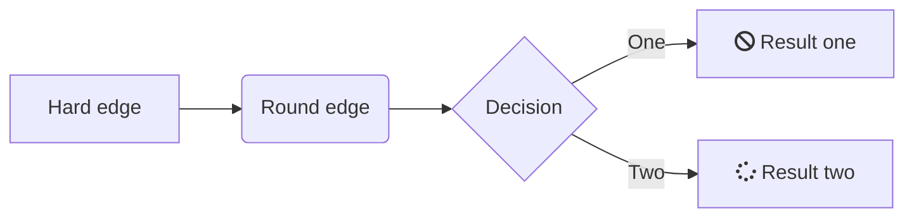
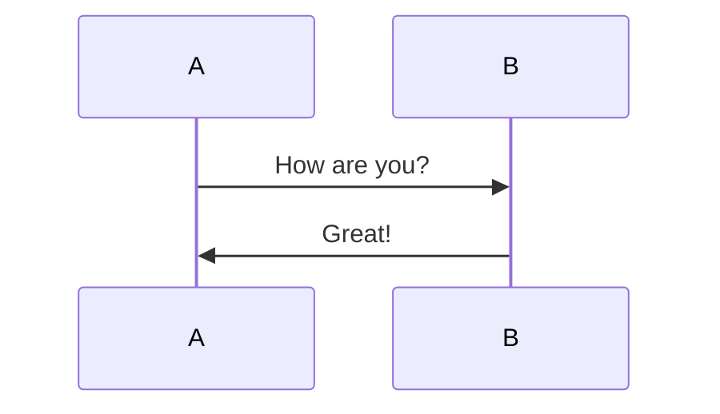
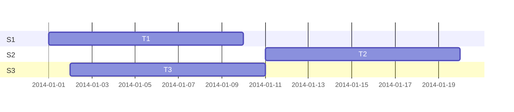

# Markdown Sample

Hello, this is markdown. The key features include:

1. Open-source
2. Markdown
3. Encrypted

> According to Glen, this is a nice free, open-source program. Feel free to either agree or disagree with Glen, but always cite your references and provide any associated evidence for your claim.

## Section 1

This is **the first content** that we'll be discussing. I have used a longer paragraph here in order to demonstrate wordwrap and how generated output will look in both HTML and PDF formats. The various notetaking programs will take different approaches to converting from markdown to PDF, but most will make use of [Pandoc](https://pandoc.org/).

------

Does markdown allow videos and interactive elements?
Let's demonstrate using `iframe code`.

### YouTube Embed
**View**: Academic Writing in Markdown

<iframe width="746" height="420" src="https://www.youtube.com/embed/hpAJMSS8pvs" frameborder="0" allow="autoplay; encrypted-media" allowfullscreen></iframe>

### TED Talk Embed
**View**: David McCandless on Data Visualization
<iframe src="https://embed.ted.com/talks/david_mccandless_the_beauty_of_data_visualization" width="746" height="420" style="position:relative;left:0;top:0;width:746;height:420" frameborder="0" scrolling="no" allowfullscreen></iframe>

### CodePen.io Embed
**View**: CodePen's Fancy Animated SVG Menu
<iframe height='265' scrolling='no' title='Fancy Animated SVG Menu' src='//codepen.io/jeangontijo/embed/OxVywj/?height=265&theme-id=0&default-tab=css,result&embed-version=2' frameborder='no' allowtransparency='true' allowfullscreen='true' style='height: 265;width: 480;'>See the Pen <a href='https://codepen.io/jeangontijo/pen/OxVywj/'>Fancy Animated SVG Menu</a> by Jean Gontijo (<a href='https://codepen.io/jeangontijo'>@jeangontijo</a>) on <a href='https://codepen.io'>CodePen</a>.
</iframe>

## Section 2

Does markdown allow images? Why yes it does.


## Section 3

Here is some shell script code to review.

```bash
# First, update your system
sudo apt update
sudo apt -y upgrade
# Now let's install some stuff
sudo apt-get install curl wget htop glances neofetch
```

How about some HTML as well.

```html
<h1>Hello World</h1>
<p class="Tidy">This is an html paragraph followed by a list.</p>
<ul><li>One</li>
<li>Two</li>
<li>Three</li></ul>
```

## Section 4

And, now for a mermaid graph (flowchart) diagram.


How about a mermaid sequence diagram?


And, lastly, a mermaid gantt diagram.


But let's not forget about katex math!
```katex
E = mc^2
```

## Section 5

### Tables
Tables are straightforward and colons can be used to align columns.

| Tables   |      Are      |  Cool |
| -------- | :-----------: | ----: |
| col 3 is | right-aligned | $1600 |
| col 2 is |   centered    |   $12 |
| col 1 is | left-aligned  |    $1 |

### Check Lists
What do I need to do today? Well, let's prepare a task list.

- [ ] Go to the market
- [ ] Vacuum the floor
- [ ] Buy more wine

### Icons and Key Buttons

Here are some basic emojis.  
:smile:  :beer:  :cat:  :dog:

And here are a variety of font-awesome icons.  
:fa-truck: :fa-bus: :fa-heart: :fa-book: :fa-save:

PRESS: <kbd>Ctrl</kbd>+<kbd>F9</kbd> to proceed

### Special Text Effects and Admonitions

The ==Highlighted== End.

::: info
You've got mail!
:::

::: danger
Don't click that link!
::: 

::: warning
Buy that lotto ticket today!
::: 

::: success
You did it!
:::

### Definition List
Term 1
  ~ Definition 1

Term 2
  ~ Definition 2a
  ~ Definition 2b
  
